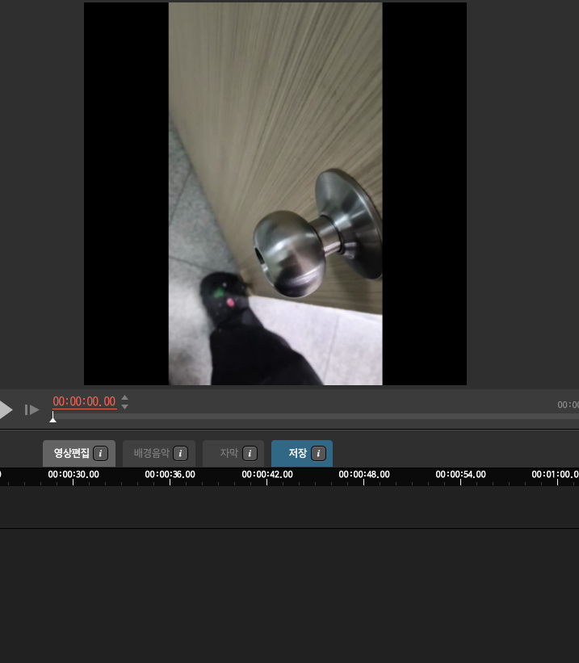

# JetsonAiSpecialist
# Nvidia AI Specialist Certification

<aside>
💡

**OverView of the Project**

- Opening background information 

- General description of the current project 

- Proposed idea for enhancements to the project

- Value and significance of this project

- Current limitations 

- Literature review

</aside>

# Title
DoorSense: A Door Recognition System for Humanoid Robots

# Opening background information

</aside>

- This project goes beyond the simple recognition of door handles and aims to develop a real-time response system for humanoid robots. The detection results are integrated into the robot's path planning algorithm, enabling autonomous decision-making, such as avoiding obstacles or preparing to interact with a detected door. Leveraging YOLOv5's capability to accurately detect small objects like door handles in real-time, the system maintains high reliability even in complex indoor environments.
The project involves simulating diverse indoor settings to construct a comprehensive dataset. Through data augmentation—which considers variables like lighting conditions, handle positions, shapes, and colors—the training model is designed to achieve generalized performance across various conditions. This ensures the robot can consistently and accurately detect door handles, enhancing its operational dependability.
Furthermore, the door recognition system is designed to integrate seamlessly with the robot’s mechanical framework, enabling future expansions to include actual door-opening mechanisms. This capability significantly broadens the potential applications of service robots in environments such as smart homes, hospitals, hotels, and commercial spaces, improving their flexibility and functionality.
Additionally, this project demonstrates the industrial applicability of AI-based object recognition technologies. The system serves as a modular platform that could be extended to recognize and interact with other objects, such as switches, buttons, or levers. This foundational work positions the technology as a key enabler for the smart era, where robots are increasingly integrated into everyday human life.
- 

# General description of the current project
</aside>

- This project aims to develop a system that enables humanoid robots to autonomously recognize doors in indoor environments. By capturing images of door handles from various angles and conditions and training a YOLOv5-based model, the robot can recognize door handles within a specific distance (defined as an `n` value) in front of it. When a door handle is detected, the robot interprets this as a "door present," allowing it to respond appropriately by either avoiding the path or preparing to open the door. This project enhances the navigation capabilities of humanoid robots, expanding their potential applications in fields like smart homes and service robotics, ultimately improving autonomous mobility.

### Value and signifiance of the project

</aside>

- This project plays a key role in advancing indoor autonomous robots and enhancing user accessibility. By recognizing small objects like door handles, the robot can detect, avoid, or interact with structures like doors, allowing it to operate flexibly in various indoor environments such as smart homes, hospitals, and hotels. Particularly, this advanced obstacle detection technology enables stable navigation even in complex settings, providing greater accessibility for elderly and disabled users, allowing for practical and personalized services. Furthermore, this project establishes foundational technology for autonomous robots to assist people and perform tasks in diverse environments, offering significant potential for expanded robot applications in the future.

### **Current limitations**
</aside>

- This project faces several limitations. First, recognizing door handles can be challenging due to variations in shape, color, position, and lighting conditions, making it difficult to maintain consistent performance across different environments. Additionally, the system can only detect door handles within a set range, limiting the robot's ability to recognize handles at a distance. Real-time object detection requires high computational resources, which can lead to increased battery consumption and costs for humanoid robots. Furthermore, simply recognizing the door handle is insufficient; additional mechanical design is required for the robot to actually open doors. To recognize various types of door handles, extensive data and training time are required, posing challenges for project progress.

### **Literature review**

</aside>

1. **Indoor Robot Navigation**
    
    Navigation technology for robots in indoor environments is a constant focus of research, especially as the ability of robots to understand surroundings and avoid obstacles independently increases their potential for use in smart homes, healthcare facilities, and commercial spaces. Recent studies incorporate various approaches, such as combining SLAM (Simultaneous Localization and Mapping), laser sensors, ultrasonic sensors, and camera vision for autonomous robot navigation, with camera vision-based navigation becoming a key component for indoor robot navigation.
    
2. **Object Recognition Technology**
    
    Object recognition plays a crucial role in enabling robots to identify specific objects. Models like YOLO (You Only Look Once) are widely used for fast, accurate object detection, with YOLOv5 offering enhanced performance and speed compared to previous versions. Research shows that YOLOv5 is particularly effective for real-time recognition, especially for small objects, making it suitable for identifying specific items like door handles in indoor environments.
    
3. **Obstacle Detection and Autonomous Movement**
    
    Obstacle detection is critical in developing autonomous robots. Numerous studies combine sensor-based detection and deep learning-based recognition technology, with deep learning helping robots more precisely interpret their surroundings and plan routes predictively. Obstacle detection systems capable of recognizing small objects like door handles are essential for overcoming limitations in indoor obstacle recognition and improving robot mobility.
    
4. **Future Applications**
    
    Advances in object recognition and navigation technology provide a solid foundation for the application of humanoid robots. The need for robots in smart homes, healthcare, and service industries is growing, and autonomous robots with navigation capabilities are poised to meet these demands. This project aligns with this research trend, aiming to improve robots' ability to independently recognize and interact with objects in indoor settings, suggesting greater utility for autonomous robots.
    

## **Image Acquisition Method:**
Captured actual indoor door handles from various angles.

(https://youtube.com/shorts/IZqbfBX37iw?feature=share)

## **Learning Data Extraction and Learning Annotation**:
To learn from YOLOv5 with 640 resolution images, we first made the images into 640 x 640 resolution images.

### Video resolution adjustment



DarkLabel, also known as Video/Image Labeling and Annotation Tool, was used to image or annotate images made at 640 x 640 resolution in frame units.


In the DarkLabel program, an image can be converted into an image in units of frames. First, a 640 x 640 resolution image is selected through Open Video. After that, labeled frames only will have the check mark enabled but deactivate the check mark. After that, it is converted into an image in a folder called images through as images


Libraries Required for Training
```
import torch
import os
from IPython.display import Image, clear_output  # to display images
```

Training Script
```
python "C:\\Users\\ASUS\\Desktop\\AI\\yolov5\\yolov5\\train.py"  --img 512 --batch 16 --epochs 300 --data C:\Users\ASUS\Desktop\AI\yolov5\yolov5\data.yaml --weights yolov5n.pt --cache
```


Running Training in CMD Environment


```img 512```: Set the size of the input image to 640x640.

```batch 16```: Sets the batch size. This indicates the number of images to be processed at one time.

```epochs 300```: Sets the total number of epochs to learn.

```C:\Users\ASUS\Desktop\AI\yolov5\yolov5\data.yaml```: Specifies the path to the YAML file containing the configuration settings for the YOLOv5 model.

```weights yolov5n.pt```: Specifies the path to the pre-trained weights file. Here, we are using the yolov5n.pt file.


 Nvidia Jetson Nano Training Result
Training results are stored in ```C:\Users\ASUS\Desktop\AI\yolov5\yolov5\runs/train```


Nvidia Jetson Nano Training Results Verification Video

## **It accurately detects door handles even when the camera is flipped**

JetsonAiSpecialist verification1
https://youtube.com/shorts/6gejM1pBcUc?feature=share

JetsonAiSpecialist verification2
https://youtube.com/shorts/sqgctFothtA?feature=share


